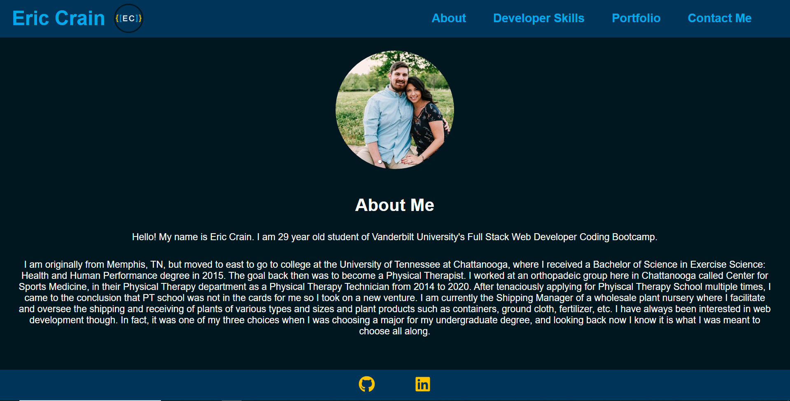
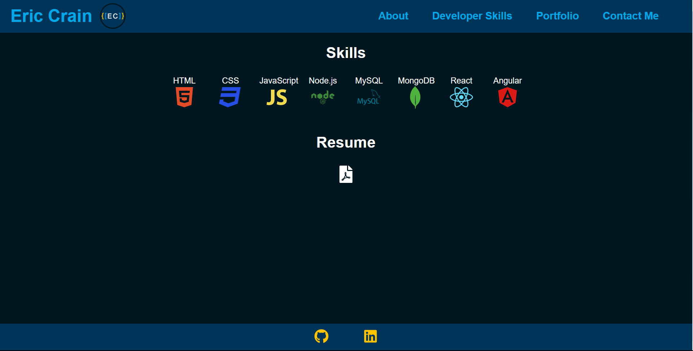
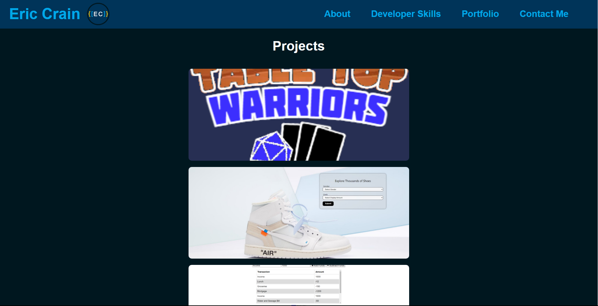
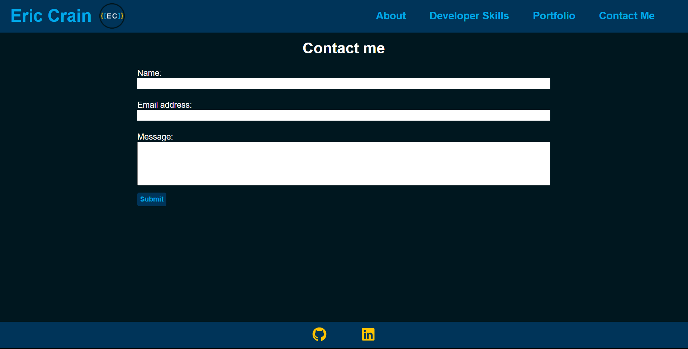

# Professional React Portfolio

Deployed Application: http://ericcrain77.github.io/eric-crain-react-portfolio

GitHub Repository: https://github.com/Ericcrain77/eric-crain-react-portfolio

## Table of Contents
* [Description](#description)
* [Screenshots](#screenshots)
* [Technologies](#technologies)
* [Questions](#questions)

## Description
The Professional Portfolio of Eric Crain.

## Screenshots
About Me Page

Developer Skills Page

Portfolio

Contact Form Page

## Technologies
This application utilizes the following npm packages:
* react
* react-bootstrap
* react-dom
* react-icons
* react-responsive-carousel
* react-scripts
* web-vitals

This application is written entirely with JSX and stylized with CSS.

## Questions
Reach out to me using my [Github account](https://github.com/Ericcrain77) or my [email](ericcrain77@gmail.com).